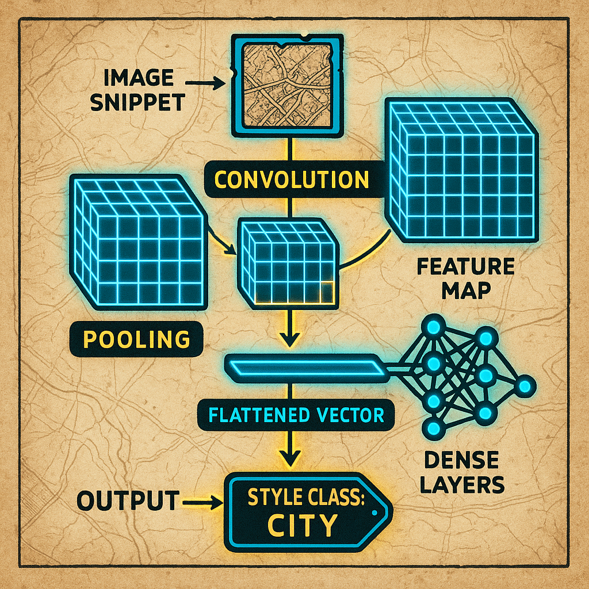
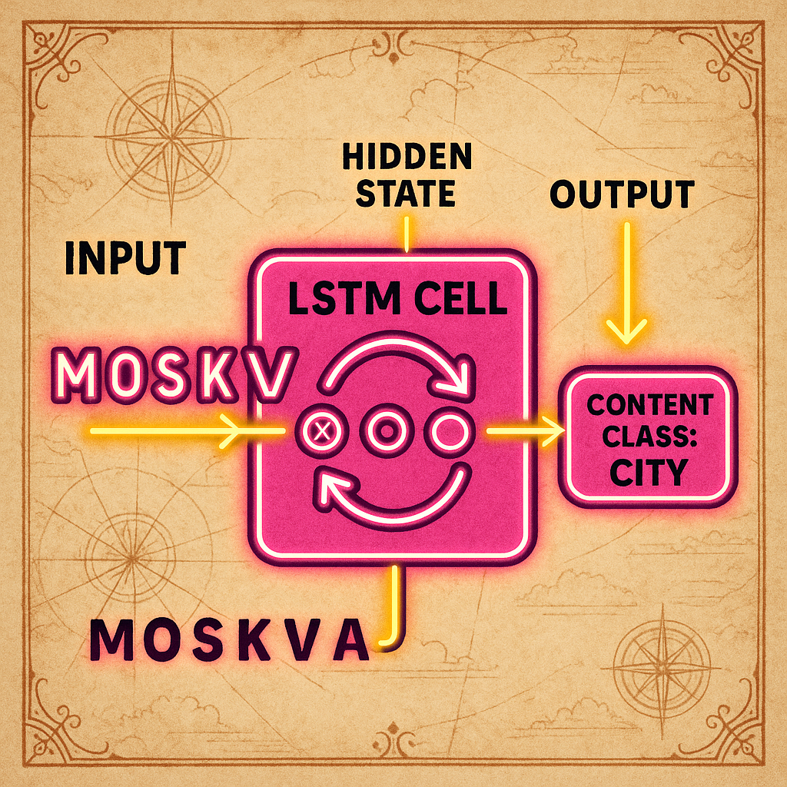

# MapOCR Toolkit: Автоматическая аннотация картографических справочников

<p align="center">
  
  
  
  
  
</p>

Этот репозиторий содержит инструменты для автоматической обработки изображений картографических справочников с целью извлечения, аннотации (будет реализовано в будущем) и классификации текстовой информации.

## 📜 Описание проблемы

Анализ и оцифровка картографических материалов - это сложная задача. Текстовые объекты на картах (названия городов, рек, улиц) обладают уникальными стилями, шрифтами и ориентацией, что бросает вызов стандартным системам распознавания. Когда к этому добавляются артефакты сканирования, шумы и искажения старых документов, задача становится еще труднее.

**Ключевая цель проекта** - разработать инструмент, способный классифицировать нужные элементы. Он должен автоматически находить текстовые блоки, распознавать их содержимое и, что самое важное, классифицировать их по смыслу (например, «населенный пункт», «гидрография», «дорожная сеть»). Конечная цель - превратить статичные, неструктурированные изображения карт в богатые, аннотированные наборы данных, готовые для сложного анализа и машинного использования.

## 💡 Архитектура MVP

Ниже представлена концептуальная схема текущего минимально жизнеспособного продукта (MVP).

<p align="center">
  
  <em>Архитектура</em>
</p>

## ✨ Ключевые возможности

-   **🖼️ Очистка изображений:** Модуль шумоподавления на основе Random Forest для улучшения читаемости сканов.
-   **👁️ Распознавание текста:** Интеграция с Tesseract и EasyOCR для извлечения текста из изображений.
-   **🧠 Классификация на основе изображений (CNN):** Сверточная нейронная сеть для классификации текстовых блоков по их визуальному стилю.
-   **✍️ Классификация на основе текста (RNN):** Рекуррентная нейронная сеть (LSTM) для классификации по семантическому содержанию распознанного текста.
-   **🚀 Демонстрационный набор данных:** Готовый набор данных с изображениями, текстовыми метками и классами для быстрого старта и тестирования.

## 🛠️ Текущее состояние

На данный момент проект представляет собой прототип, включающий несколько ключевых модулей для комплексного анализа картографического текста.

1.  **Модуль очистки изображений:** Реализован алгоритм на базе **Random Forest Regression (RFR)**. Он улучшает качество изображений, но на данном этапе может удалять важные детали, поэтому его использование для задач классификации требует осторожности.

2.  **Распознавание текста (OCR):** Проведено тестирование и базовая интеграция **Tesseract** и **EasyOCR**. Для демонстрационного набора данных (`data/raw_demo_images/`) были сгенерированы текстовые версии надписей.

3.  **Двойная модель классификации:**
    *   **CNN (анализ стиля):** Разработана модель на основе сверточной нейронной сети (`mapocr_toolkit/cnn/cnn_model.py`), которая анализирует непосредственно **изображение** текстового блока (200x60 пикселей) и классифицирует его по визуальным признакам. Скрипт `scripts/train_cnn.py` позволяет обучить модель на демо-данных.
     <p align="center">
       
       <br/><em>Концептуальная схема CNN модели</em>
     </p>
        
    *   **RNN (анализ содержания):** Разработана модель на основе LSTM (`mapocr_toolkit/rnn/rnn_model.py`), которая анализирует **распознанный текст** и классифицирует его по содержанию. Скрипт `scripts/train_rnn.py` отвечает за обучение.
     <p align="center">
       
       <br/><em>Концептуальная схема RNN модели</em>
     </p>

4.  **Подготовка данных:** Созданы утилиты (`mapocr_toolkit/utils/`) для загрузки данных, предобработки изображений для CNN и токенизации/one-hot кодирования текстов для RNN.

## 🚀 Планы на будущее

-   **Интеграция:** Объединить модули OCR, CNN и RNN в единый пайплайн, формирующий структурированный вывод: `[текст, тип_объекта, координаты]`.
-   **Расширение модели:** Разработать комбинированную архитектуру (возможно, CNN-LSTM) для одновременного анализа стиля и содержания.
-   **Визуализация:** Реализовать отображение аннотированной информации (рамок и меток) на исходных изображениях.
-   **Сбор данных:** Существенно расширить обучающий набор данных для повышения точности и обобщающей способности моделей.

## ⚙️ Настройка и запуск

1.  **Клонируйте репозиторий:**
    ```bash
    git clone <URL_репозитория>
    cd MapOCR-Toolkit
    ```
2.  **Установите зависимости:**
    ```bash
    pip install -r requirements.txt
    ```
3.  **Обучение моделей:**
    *   Для обучения **CNN** модели на демонстрационных данных выполните:
        ```bash
        python scripts/train_cnn.py
        ```
    *   Для обучения **RNN (LSTM)** модели на демонстрационных данных выполните:
        ```bash
        python scripts/train_rnn.py
        ```
    *   Обученные модели и файлы предобработки будут сохранены в директории `models/demo/`.

## 🏷️ Подготовка разметки для `dataset_CLEANED_v2.csv`

Чтобы ускорить ручную разметку перед переобучением, можно автоматически подготовить очередь примеров:

```bash
python scripts/prepare_labeling_queue.py \
  --input data/dataset_CLEANED_v2.csv \
  --output data/dataset_CLEANED_v2_labeled.csv \
  --confidence-threshold 0.8
```

Что делает скрипт:
- добавляет колонку `label` (если её нет);
- добавляет флаг `priority_for_labeling` (`confidence >= threshold`);
- сортирует строки так, чтобы сначала шли самые уверенные распознавания (их проще и быстрее размечать).

После разметки этот файл можно использовать в обучении через `mapocr_toolkit/utils/data_loader.py` (или задать путь через `MAPOCR_LABELS_PATH`).
