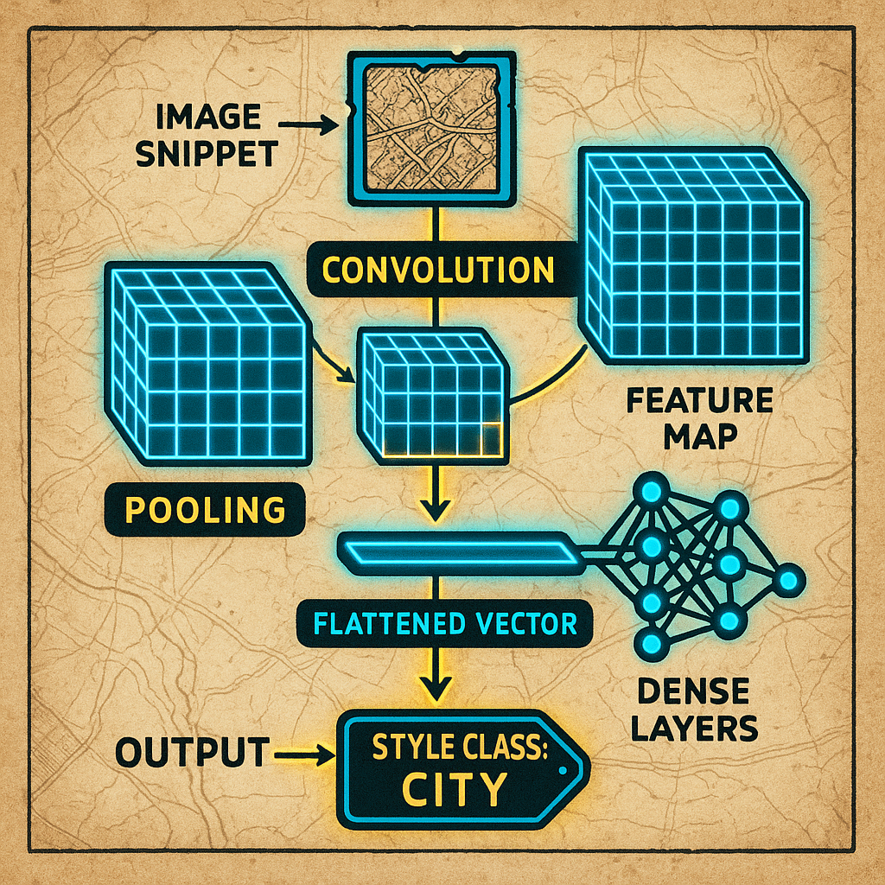
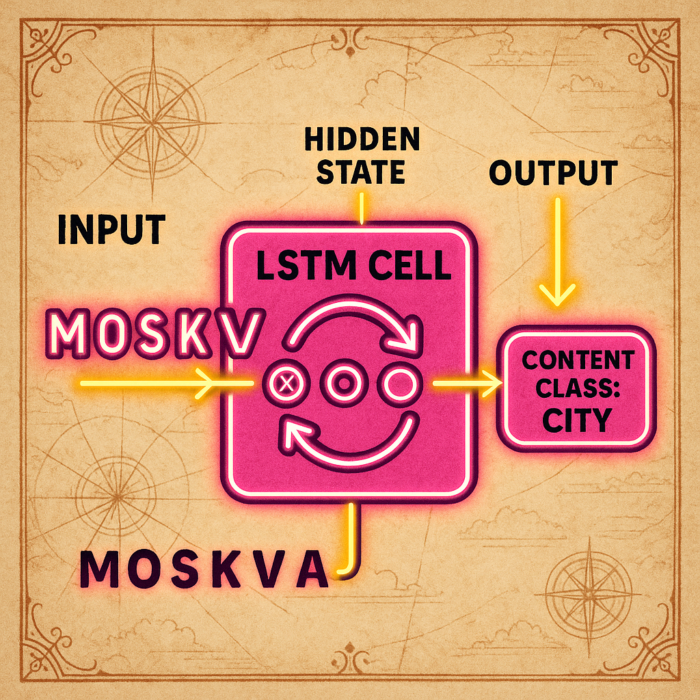

# MapOCR Toolkit: Автоматическая аннотация текстовых объектов на картографических изображениях

<p align="center">
  
</p>

<p align="center">
  
  
  
  
  
  
</p>

ВКР — ННГУ им. Н.И. Лобачевского, 2025–2026.  
**Тема:** «Разработка системы автоматической аннотации текстовых объектов на картографических изображениях с использованием нейронных сетей»

---

## 📜 Описание задачи

Отсканированные топографические карты — это растровые изображения размером более 100 МПикс. Текстовые надписи на них (названия городов, рек, деревень) обладают уникальными стилями шрифта: населённые пункты — прямой шрифт, гидрография — курсив, крупные города — заглавный жирный. Задача — автоматически найти все надписи, распознать текст и определить **тип географического объекта** по каждой надписи, получив на выходе структурированную таблицу `[текст, класс, координаты]`.

Стандартные OCR-системы справляются только с первой частью. Классификация требует совместного анализа **визуального стиля шрифта** и **текстового содержания** — именно это решает данная система.

---

## 🏗️ Архитектура системы

<p align="center">
  
  <br/><em>Полный пайплайн: от TIF-карты до аннотированного HTML</em>
</p>

Система состоит из пяти этапов:

1. **Нарезка** — скользящее окно 2000×2000 px с перекрытием 400 px по исходному TIF
2. **OCR** — PaddleOCR v3 извлекает текст и координаты каждой надписи
3. **Фильтрация + разметка** — автоматическая очистка мусора, ручная верификация классов через браузерный инструмент
4. **Классификация** — ансамбль CNN (стиль шрифта) + RNN (текст) с Soft Voting
5. **Визуализация** — интерактивная HTML-карта с цветными боксами по классам

---

## ✨ Ключевые возможности

- **🗺️ Обработка карт >100 МПикс** — скользящее окно с настраиваемым перекрытием, защита от потерь на границах фрагментов
- **👁️ PaddleOCR** — SOTA-движок, устойчивый к наклонному тексту и картографическому фону
- **🏷️ Браузерный инструмент разметки** — `label_tool.py` без внешних зависимостей, горячие клавиши, автосохранение
- **🧠 CNN-классификатор** — анализирует визуальный стиль шрифта (курсив, засечки, размер)
- **✍️ RNN/LSTM-классификатор** — анализирует текстовое содержание (морфология, суффиксы)
- **🔗 Ансамбль CNN+RNN** — Soft Voting даёт прирост +5.4% к accuracy и +0.04 к macro F1 относительно лучшей одиночной модели
- **🔬 CRNN-эксперимент** — исследование end-to-end альтернативы ансамблю (stretch goal)
- **🗺️ Интерактивная визуализация** — Plotly HTML с цветными боксами, hover-подсказками и зумом

---

## 📊 Результаты

Все модели обучены и оценены на одном разбиении: 1808 примеров, валидация 703 примера (val_split=0.35, random_state=42).

| Модель | Accuracy | Macro F1 | hydro F1 | city F1 |
|--------|----------|----------|----------|---------|
| CNN baseline (61 пример) | 81.8% | — | — | — |
| RNN baseline (61 пример) | 84.2% | — | — | — |
| CNN (Issue #9) | 85.1% | 0.58 | 0.79 | 0.74 |
| RNN (Issue #10) | 86.2% | 0.35 | 0.00 | 0.75 |
| **Ансамбль Soft Voting (Issue #11)** | **90.5%** | **0.62** | **0.83** | **0.81** |
| CRNN (Issue #13) | 83.1% | 0.29 | 0.00 | 0.55 |

**Почему CRNN уступила ансамблю:** ансамбль использует два независимых сигнала — пиксели и OCR-текст. CRNN работает только с пикселями. Без текстового сигнала модель не может отличить `hydro` и `other` от `settlement`. Подробный разбор: [`crnn_results_issue13.md`](crnn_results_issue13.md).

<p align="center">
  
  <br/><em>Ансамбль CNN+RNN: Soft Voting по векторам вероятностей</em>
</p>

---

## 🏷️ Классы объектов

| Класс | Описание | Визуальный признак | Примеры |
|-------|----------|--------------------|---------|
| `city_major` | Крупный город | ЗАГЛАВНЫЙ жирный шрифт | НОВОРЖЕВ, ПСКОВ |
| `city` | Небольшой город / райцентр | Заглавная первая, прямой шрифт | Порхов, Дно |
| `settlement` | Деревня, село, посёлок | Строчный, самый частый класс | Ягодино, Крюково |
| `hydro` | Водный объект | Курсив, часто с префиксом | оз.Баткаское, р.Ловать |

> Класс `other` используется при разметке для технических надписей и не участвует в обучении.

---

## 🧠 Архитектуры моделей

### CNN — классификация по стилю шрифта

<p align="center">
  
  <br/><em>Вход: кроп 200×60 px → два Conv-блока → Dense(5, Softmax)</em>
</p>

```
Conv2D(32) → MaxPool(2×2) → Conv2D(64) → MaxPool(2×2)
→ Flatten → Dense(128, ReLU) → Dropout(0.5) → Dense(5, Softmax)
```

### RNN/LSTM — классификация по тексту

<p align="center">
  
  <br/><em>Вход: посимвольная one-hot последовательность → LSTM(128) → Dense(5, Softmax)</em>
</p>

```
One-hot(char, max_len=29, vocab=137) → LSTM(128) → Dense(64, ReLU) → Dropout(0.5) → Dense(5, Softmax)
```

### CRNN — end-to-end эксперимент (Issue #13)

<p align="center">
  
  <br/><em>CNN-часть сжимает высоту до 1 пикселя → BiLSTM читает последовательность колонок слева направо</em>
</p>

```
Conv×5 с пулингом только по высоте → squeeze → Bidirectional(LSTM(128)) → Dropout(0.5) → Dense(5, Softmax)
```

---

## ⚙️ Установка и запуск

```bash
git clone https://github.com/ProNinjaDev/MapOCR-Toolkit.git
cd MapOCR-Toolkit
pip install -r requirements.txt
```

### Полный цикл обработки карты

```bash
# 1. Нарезка TIF + OCR
python scripts/slice_paddle.py

# 2. Фильтрация мусора
python scripts/filter_dataset.py

# 3. Ручная разметка в браузере (открывает localhost:8765)
python scripts/label_tool.py

# 4. Обучение моделей
python scripts/train_cnn.py
python scripts/train_rnn.py

# 5. Оценка ансамбля (все три стратегии)
python scripts/ensemble_eval.py --strategy all

# 6. Визуализация на карте
python scripts/visualize_map.py --map <имя_файла.tif> --scale 0.4
```

Результат шага 6 — интерактивный HTML-файл `outputs/map_annotated.html`.

### Обучение CRNN (опционально)

```bash
python scripts/train_crnn.py
# или без transfer learning:
python scripts/train_crnn.py --skip-transfer
```

### Диагностика координат

```bash
python scripts/visualize_map.py --map <файл.tif> --diagnose
```

---

## 📁 Структура проекта

```
MapOCR-Toolkit/
├── data/
│   ├── raw_tifs/                    # Исходные TIF-карты
│   ├── dataset_crops_paddle/        # Вырезанные кропы
│   ├── dataset_paddle.csv           # OCR-результаты с координатами
│   ├── dataset_CLEANED_v2.csv       # После фильтрации мусора
│   └── dataset_LABELED.csv          # После ручной разметки (2008 примеров)
├── mapocr_toolkit/
│   ├── cnn/cnn_model.py
│   ├── rnn/rnn_model.py
│   ├── crnn/crnn_model.py           # + transfer learning из CNN
│   └── utils/                       # data_loader, cnn/rnn preprocessors
├── models/demo/
│   ├── cnn/                         # accuracy=85.1%, macro F1=0.58
│   ├── rnn/                         # accuracy=86.2%, macro F1=0.35
│   ├── crnn/                        # accuracy=83.1%, macro F1=0.29
│   └── ensemble/                    # confusion matrices всех стратегий
├── scripts/
│   ├── slice_paddle.py              # Нарезка TIF + PaddleOCR
│   ├── filter_dataset.py            # Автофильтрация
│   ├── label_tool.py                # Браузерный инструмент разметки
│   ├── train_cnn.py / train_rnn.py / train_crnn.py
│   ├── ensemble_eval.py             # Три стратегии ансамблирования
│   └── visualize_map.py             # Интерактивная карта (Plotly)
├── outputs/
│   └── map_annotated.html           # Аннотированная карта
├── cnn_results_issue9.md            # Детальный разбор CNN
├── crnn_results_issue13.md          # Детальный разбор CRNN + анализ провала
└── requirements.txt
```

---

## 🔬 Методология

Ключевое решение — **Human-in-the-Loop (HITL)**: автоматическая нарезка и OCR создают очередь кандидатов, ручная верификация через `label_tool.py` расставляет финальные метки. Разметка датасета из 61 объекта занимала 20 минут, расширенного датасета из 2008 объектов — порядка нескольких часов суммарно.

Дисбаланс классов (settlement 82.6%) компенсируется `class_weight='balanced'` + аугментацией редкого класса `city_major` (9 реальных примеров → 70 через повороты и яркость).

---

## 📌 Открытые задачи

- `[BUG]` `slice_paddle.py`: координаты PaddleOCR v3.3.2 возвращаются в системе координат внутренне повёрнутого изображения — ведётся исправление в ветке `fix/N-paddleocr-crop-coordinates`
- `[Issue #15]` Оптимизация производительности `visualize_map.py` — тайловая загрузка / lazy rendering для карт >100 МПикс
